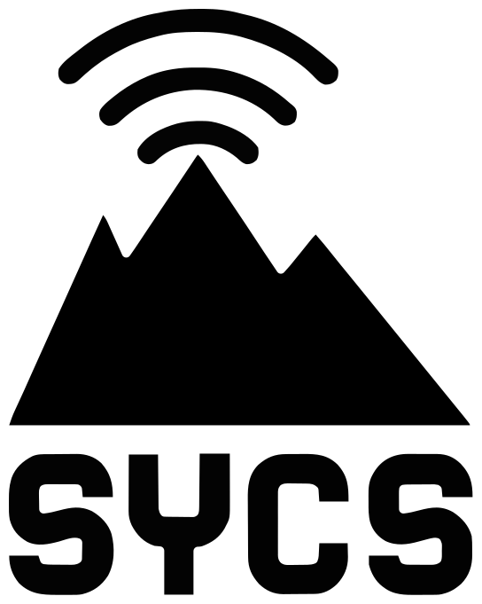

  
 

Shinjuku Yamabuki Chat System

 

> [!IMPORTANT]
> This application is Work in Progress!

## About
This application is a bulletin board–style communication software.
It is still under development, so significant changes may be made in the future...

## How to use
There are required environments to run this application.
However, since it is still in the early stages of development, they cannot be listed yet.

## Credits
As this project is still in the early stages of development, the frameworks, libraries, and programming languages used for the application cannot be specified at this time.
